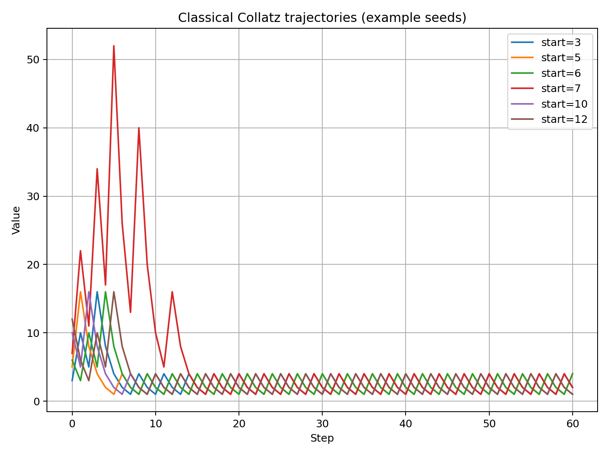
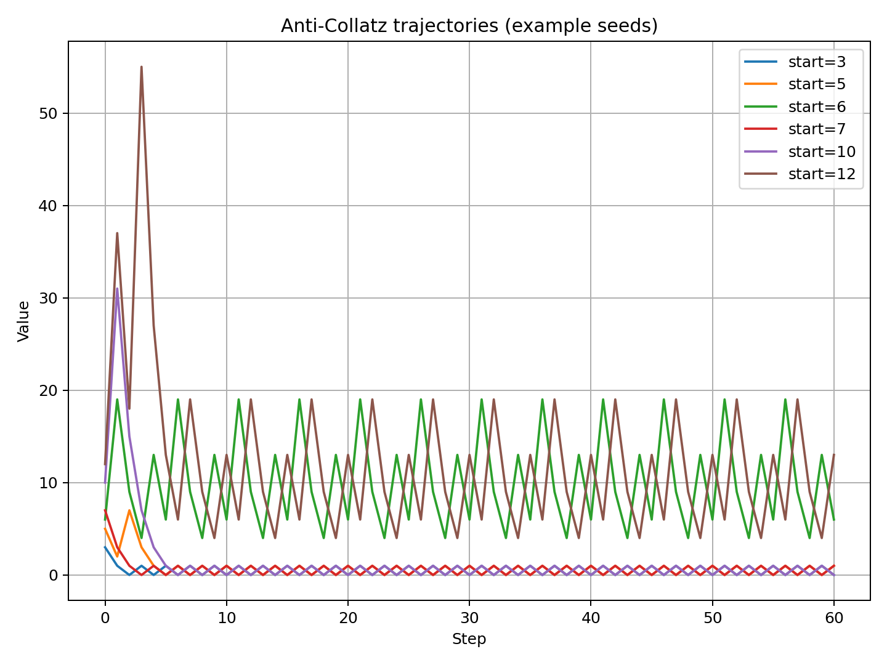
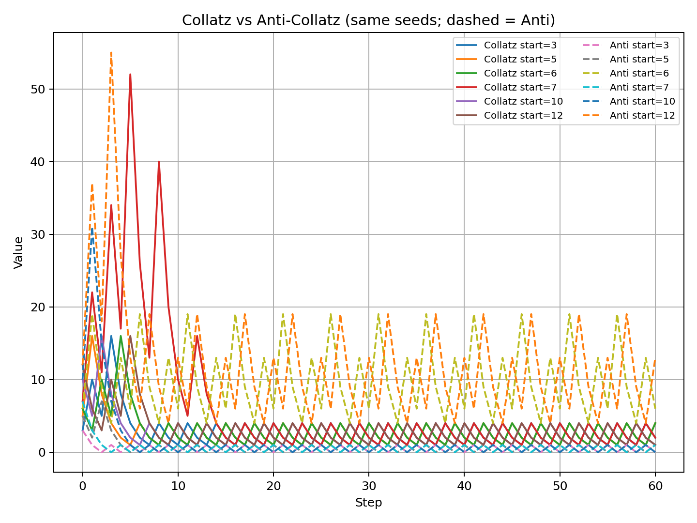
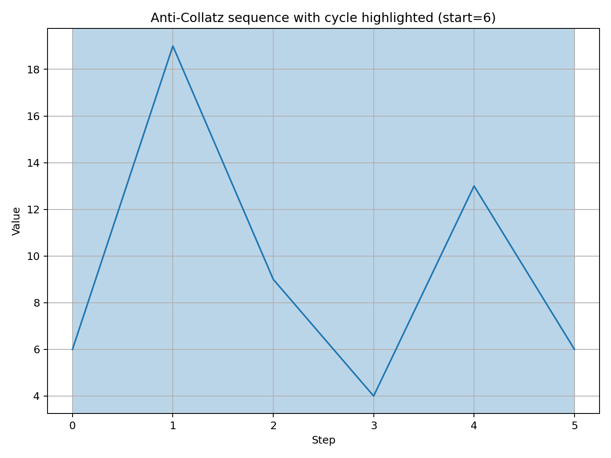
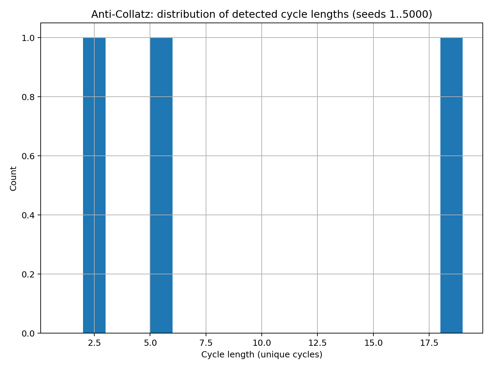

# Anti-Collatz Map
*A parity-inverted companion to the classical 3n+1 rule (Collatz)*

This repository documents a **parity-inverted** variant of the classical Collatz map.

## Definition

Classical Collatz:
\[
T(n)=
\begin{cases}
n/2 & n\equiv 0\pmod{2}\\
3n+1 & n\equiv 1\pmod{2}
\end{cases}
\]

**Anti-Collatz (parity-inverted):**
\[
T_{\text{anti}}(n)=
\begin{cases}
3n+1 & n\equiv 0\pmod{2}\\
\lfloor n/2\rfloor & n\equiv 1\pmod{2}
\end{cases}
\]

Empirically, Anti-Collatz is typically **repulsive** (many orbits grow large), and it admits **non-trivial cycles**.

> Terminology note: “anti-Collatz” is not a standardized label and appears informally online with multiple meanings.
> In this repo, **Anti-Collatz** always refers to the parity-inverted map above.

---

## Quick start

```bash
pip install -r requirements.txt
python anti_collatz.py --demo --seed 6
```

---

## Key empirical observations

- **Non-trivial cycles exist**, e.g.:
  \[
  6 \to 19 \to 9 \to 4 \to 13 \to 6
  \]
- Orbits often show **jump–collapse dynamics**: expansion spikes on even steps (\(3n+1\)),
  followed by contraction cascades via repeated odd halving (\(\lfloor n/2\rfloor\)).
- Compared to classical Collatz (conjectured global convergence to the 4→2→1 loop),
  Anti-Collatz exhibits **multiple attracting cycles** and frequent large excursions.

---

## Figures (reproducible)

**Classical Collatz trajectories (example seeds):**



**Anti-Collatz trajectories (same seeds):**



**Overlay comparison (dashed = Anti-Collatz):**



**Anti-Collatz cycle detection example (start=6, cycle region shaded):**



**Cycle-length histogram (unique cycles detected from seeds 1..5000):**



---

## Results data

- `data/anti_cycles_up_to_5000.csv` — unique cycles detected when scanning seeds 1..5000 (with a finite iteration cap).

---

## Repository contents

- `research_note.md` — research-style note (definitions + empirical results + open questions)
- `anti_collatz.py` — reference implementation + small CLI demo
- `notebooks/anti_collatz_exploration.ipynb` — annotated notebook reproducing plots + cycle census
- `figures/` — generated PNGs
- `data/` — small CSV datasets (generated)

---

## Conjectures and questions (work-in-progress)

These are intentionally phrased as **empirical prompts**, not claims:

1. **Cycle abundance:** How does the number of *distinct* cycles detected grow with the scan bound \(N\)?
2. **Basin structure:** What is the distribution of basin sizes (number of seeds mapping into each cycle) as \(N\) increases?
3. **Escape behavior:** For seeds that do not enter a short cycle quickly, what are typical growth rates and “spike height” statistics?
4. **Cycle construction:** Can families of cycles be constructed analytically for this parity-inverted map?

If you run larger scans (e.g. \(N\ge 10^6\)), please open an issue with your results.

---

